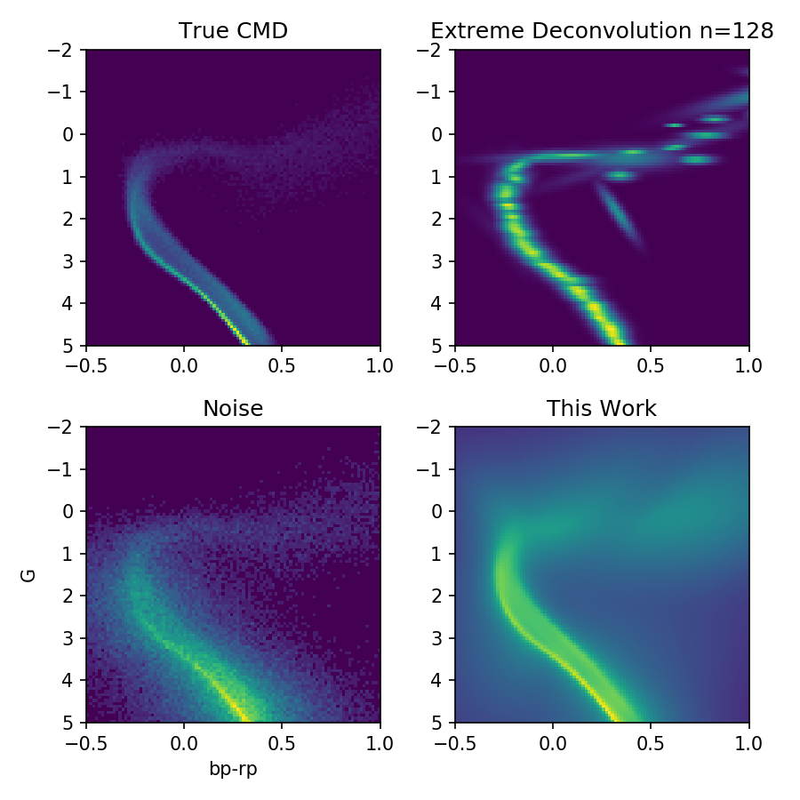

Code for comparing a normalizing flow to extreme-deconvolution
in reconstructing a color-magnitude diagram
from noisy observations. Open 'Demo.ipynb' and run,
modifying to your system.

Requirements:
- https://github.com/rtqichen/torchdiffeq
- https://github.com/jobovy/extreme-deconvolution
- https://github.com/tholoien/XDGMM

The demo is based on the normalizing flow code from here: https://github.com/rtqichen/ffjord, with added treatment of noise.

The paper demonstrating this on real data is here: https://arxiv.org/abs/1908.08045. (This one uses MADE)
